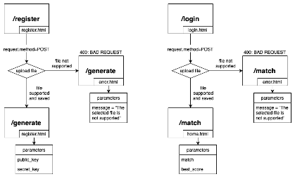

# flask_fingerprint

Biometric information is unique and safe for every individual, and replication of biometric template is challenging which makes its application systems more secure compared to traditional methods such as password and PIN. However, due to the immutability of biometric information, a leakage of biometric information may cause consecutive security threats.

An asymmetric-key cryptosystem is mainly used for secure exchanging of session key parameters and digitally signing electronic messages. It uses a pair of keys: the public key and private key.

The aim of this project was to create a code that could generate a keypair starting from a fingerprint and being able to recognize a fingerprint if it had already been entered previously, considering the risk that the data biometric changes over time and therefore managing to identify the fingerprint even in the face of drastic changes.

## Implementation

This is our Flask server implementation, capable of running HTTP requests for our purpose.

For a complete documentation, see [here](doc/Business%20Report.pdf).

## Test

Link to the dataset [here](https://www.kaggle.com/datasets/ruizgara/socofing).

For testing, the code was ideally divided into three main subparts: feature extraction, key-pair generation, and fingerprint matching. This subdivision was useful to be able to understand the peculiarities and weaknesses of the code, to be able to intervene where necessary.

For a complete report, see [here](doc/Test%20Report.pdf).

## Results

Check the [tutorial](https://www.youtube.com/watch?v=ytNBpp5phQw).

## Contact

- [Domenico de Gioia](mailto:d.degioia1@studenti.poliba.it)
- [Ivan Maddalena](mailto:i.maddalena1@studenti.poliba.it)